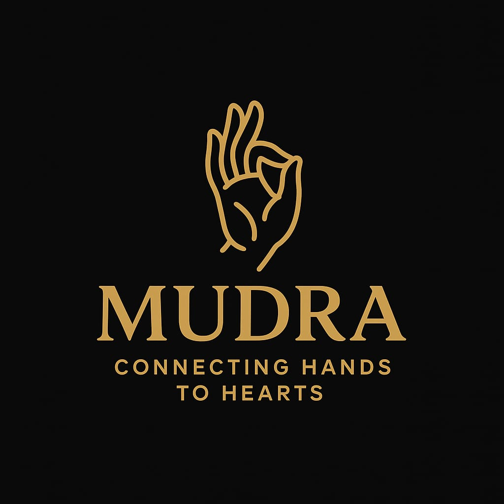

# 🤟 MUDRA: Real-Time Indian Sign Language (ISL) Translator

<div align="center">



**An intelligent, vision-based communication bridge translating Indian Sign Language gestures into text and multilingual speech in real-time.**

[](https://www.python.org/)
[](https://streamlit.io/)
[](https://developers.google.com/mediapipe)
[](https://tensorflow.org/)
[](https://share.streamlit.io/)
[](https://opensource.org/licenses/MIT)

**Engineered with precision by [Sohail Shaikh](https://github.com/SohailShaikh03)**

[Overview](#-overview) •
[Features](#-key-features) •
[System Architecture](#-system-architecture) •
[Deploy to Web](#-deploying-live-to-the-web) •
[Local Quickstart](#-local-installation--quickstart) •
[Device Compatibility](#-cross-device-compatibility-phone--pc) •
[ISL Alphabet](#-supported-gestures)

---

</div>

## 🌟 Overview

**Mudra** is designed to eliminate the communication gap between individuals with hearing/speech impairments and the wider community. Using state-of-the-art computer vision and neural classification, Mudra tracks 21 individual hand joint landmarks, normalizes them into scale-invariant vectors, and classifies the corresponding sign across **35 Indian Sign Language (ISL) classes** (Digits 1–9 and Letters A–Z).

Mudra converts hand gestures into a formatted sentence and provides instant vocalization via **Text-to-Speech (TTS)** in **English, Hindi, and Marathi**.

---

## ⚡ Key Features

- **🌐 100% Web & Mobile Ready (Cross-Device):** Run smoothly on smartphones (iOS Safari, Android Chrome), tablets, and desktop computers.
- **🔄 Dual Camera Engine:**
  - **WebRTC Mode:** Directly captures client webcam through the browser for cloud deployments and mobile phones.
  - **Local OpenCV Mode:** High-speed hardware stream for local development.
- **🎯 35 Gesture Classes:** Full coverage of ISL alphanumeric signs: Numbers `1` to `9` and English alphabet `A` to `Z`.
- **🛡️ Gesture Stabilization Engine:** Sliding-window debounce filter eliminates frame jitter and misclassifications during hand movement.
- **🗣️ Multilingual Speech & Translation Studio:** One-tap audio output in English, Hindi, and Marathi powered by neural translation.
- **🎨 Signature Cyber-Saffron Theme:** High-contrast, dark-mode glassmorphic interface with glowing landmark visualization.
- **📖 Interactive ISL Cheatsheet:** Built-in alphabet dictionary and gesture guide for quick learning.

---

## 🏗️ System Architecture

```
                    ┌─────────────────────────┐
                    │     USER VIDEO STREAM   │
                    │   (WebRTC / Local Cam)  │
                    └────────────┬────────────┘
                                 │
                                 ▼
                    ┌─────────────────────────┐
                    │   MediaPipe Hands (AI)  │
                    │ 21 3D Skeletal Keypoints│
                    └────────────┬────────────┘
                                 │
                                 ▼
                    ┌─────────────────────────┐
                    │ Landmark Preprocessing  │
                    │ 42 Feature Coordinates  │
                    │  (Scale & Trans Invar)  │
                    └────────────┬────────────┘
                                 │
                                 ▼
                    ┌─────────────────────────┐
                    │    ISL Keras Model      │
                    │  Dense Neural Classifier │
                    └────────────┬────────────┘
                                 │
                                 ▼
                    ┌─────────────────────────┐
                    │ Temporal Hold Debouncer │
                    │ Confidence Filter >= 65%│
                    └────────────┬────────────┘
                                 │
                                 ▼
                    ┌─────────────────────────┐
                    │    Sentence Studio UI   │
                    │ Words • Tokens • Action │
                    └────────────┬────────────┘
                                 │
                                 ▼
                    ┌─────────────────────────┐
                    │  gTTS / Translation API │
                    │ English • Hindi • Marathi│
                    └────────────┬────────────┘
                                 │
                                 ▼
                             🔊 AUDIO
```

---

## 🚀 Deploying Live to the Web

Mudra is pre-configured with `requirements.txt`, `packages.txt`, and `.streamlit/config.toml` for 1-click deployment on **Streamlit Community Cloud**:

1. **Push your code to GitHub:**
   ```bash
   git add .
   git commit -m "feat: signature Mudra v2.0 with cloud and mobile readiness"
   git push origin main
   ```

2. **Go to [share.streamlit.io](https://share.streamlit.io/)** and sign in with GitHub.
3. Click **"New app"** and select:
   - **Repository:** `SohailShaikh03/Mudra`
   - **Branch:** `main`
   - **Main file path:** `main.py`
4. Click **Deploy!**
   > *Your app will be live with an instant public URL accessible worldwide on phones, laptops, and tablets.*

---

## 💻 Local Installation & Quickstart

### 1. Clone the Repository
```bash
git clone https://github.com/SohailShaikh03/Mudra.git
cd Mudra
```

### 2. Set Up Virtual Environment (Recommended)
```bash
python -m venv .venv

# On Windows:
.venv\Scripts\activate

# On macOS/Linux:
source .venv/bin/activate
```

### 3. Install Dependencies
```bash
pip install -r requirements.txt
```

### 4. Launch Application
```bash
streamlit run main.py
```
Open [http://localhost:8501](http://localhost:8501) in your browser.

---

## 📱 Cross-Device Compatibility (Phone & PC)

| Platform | Recommended Mode | Camera Default | Audio Support |
| :--- | :--- | :--- | :--- |
| **Android (Chrome)** | Web Browser Camera (WebRTC) | Front Selfie Camera | Supported (Tap to Play) |
| **iOS / iPhone (Safari)** | Web Browser Camera (WebRTC) | Front Selfie Camera | Supported (Tap to Play) |
| **Windows / macOS / Linux** | Web Browser or Local Camera | Integrated / USB Webcam | Full Auto/Tap Play |

> 💡 **Mobile Tip:** For optimal performance on mobile phones, hold your device in portrait mode and ensure your hand is centered within the camera viewport.

---

## 🖐️ Supported Gestures

Mudra recognizes 35 standard Indian Sign Language hand configurations:

```
Numbers : [ 1, 2, 3, 4, 5, 6, 7, 8, 9 ]
Alphabet: [ A, B, C, D, E, F, G, H, I, J, K, L, M,
            N, O, P, Q, R, S, T, U, V, W, X, Y, Z ]
```

---

## 📂 Repository Structure

```
Mudra/
├── .streamlit/
│   └── config.toml          # Custom theme, brand palette & server settings
├── .gitignore               # Git ignore patterns
├── Poster_isl.png           # ISL gesture reference poster
├── README.md                # Comprehensive documentation
├── convert.py               # Model conversion utilities
├── main.py                  # Core Streamlit application & WebRTC pipeline
├── model_isl.h5             # Original trained Keras model
├── model_isl_fixed.h5       # Production optimized model
├── model_isl_fixed.tflite   # Quantized TFLite edge model
├── mudralogo.jpg            # Mudra branding graphic
├── packages.txt             # Linux system dependencies for cloud deployment
├── requirements.txt         # Pinned Python package dependencies
└── train_model.py           # Model definition & training routines
```

---

## 👨‍💻 Author & Attribution

**Sohail Shaikh**
- GitHub: [@SohailShaikh03](https://github.com/SohailShaikh03)
- Project: **Mudra — ISL Real-Time Neural Translator**

---

## 📄 License

This project is licensed under the [MIT License](LICENSE).
